---
## Front matter
title: "Лабораторная работа 1"
subtitle: "по архитектуре компьютеров"
author: "Екатерины Алексеевны Козловой"

## Generic otions
lang: ru-RU
toc-title: "Содержание"

## Bibliography
bibliography: bib/cite.bib
csl: pandoc/csl/gost-r-7-0-5-2008-numeric.csl

## Pdf output format
toc: true # Table of contents
toc-depth: 2
lof: true # List of figures
lot: true # List of tables
fontsize: 12pt
linestretch: 1.5
papersize: a4
documentclass: scrreprt
## I18n polyglossia
polyglossia-lang:
  name: russian
  options:
	- spelling=modern
	- babelshorthands=true
polyglossia-otherlangs:
  name: english
## I18n babel
babel-lang: russian
babel-otherlangs: english
## Fonts
mainfont: PT Serif
romanfont: PT Serif
sansfont: PT Sans
monofont: PT Mono
mainfontoptions: Ligatures=TeX
romanfontoptions: Ligatures=TeX
sansfontoptions: Ligatures=TeX,Scale=MatchLowercase
monofontoptions: Scale=MatchLowercase,Scale=0.9
## Biblatex
biblatex: true
biblio-style: "gost-numeric"
biblatexoptions:
  - parentracker=true
  - backend=biber
  - hyperref=auto
  - language=auto
  - autolang=other*
  - citestyle=gost-numeric
## Pandoc-crossref LaTeX customization
figureTitle: "Рис."
tableTitle: "Таблица"
listingTitle: "Листинг"
lofTitle: "Список иллюстраций"
lotTitle: "Список таблиц"
lolTitle: "Листинги"
## Misc options
indent: true
header-includes:
  - \usepackage{indentfirst}
  - \usepackage{float} # keep figures where there are in the text
  - \floatplacement{figure}{H} # keep figures where there are in the text
---

# Цель работы

Цель данной лабораторной работы-приобретение практических навыков установки операционной системы на виртуальную машину, настройки минимально необходимых для дальнейшей работы сервисов.

# Задание

1. Создание виртуальной машины
2. Установка операционной системы
3. После установки: обновление, повышение комфорта работы, автоматическое обновление, отключение SELinux 
4. Установка драйверов для VirtualBox
5. Настройка раскладки клавиатуры
6. Устанвока имени пользователя и названия хоста
7. Устанвока программного обеспечения для создания документации
8. Домашнее задание
9. Контрольные вопросы

# Теоретическое введение

Здесь описываются теоретические аспекты, связанные с выполнением работы.

Например, в табл. @tbl:std-dir приведено краткое описание стандартных каталогов Unix.

: Описание некоторых каталогов файловой системы GNU Linux {#tbl:std-dir}

| Имя каталога | Описание каталога                                                                                                          |
|--------------|----------------------------------------------------------------------------------------------------------------------------|
| `/`          | Корневая директория, содержащая всю файловую                                                                               |
| `/bin `      | Основные системные утилиты, необходимые как в однопользовательском режиме, так и при обычной работе всем пользователям     |
| `/etc`       | Общесистемные конфигурационные файлы и файлы конфигурации установленных программ                                           |
| `/home`      | Содержит домашние директории пользователей, которые, в свою очередь, содержат персональные настройки и данные пользователя |
| `/media`     | Точки монтирования для сменных носителей                                                                                   |
| `/root`      | Домашняя директория пользователя  `root`                                                                                   |
| `/tmp`       | Временные файлы                                                                                                            |
| `/usr`       | Вторичная иерархия для данных пользователя                                                                                 |

Более подробно об Unix см. в [@gnu-doc:bash;@newham:2005:bash;@zarrelli:2017:bash;@robbins:2013:bash;@tannenbaum:arch-pc:ru;@tannenbaum:modern-os:ru].

# Выполнение лабораторной работы

1. Создание виртуальной машины

У меня уже была установлена (через установщик с официального сайта, файл exe) и настроена виртуальная машина VirtualBox.

2. Установка операционной системы

На моей виртуальной машине стояла операционная система fedora linux, я загрузила iso образ файла версии для 64 битной системы и настроила 80 гб на жёсткий диск, 5000 мб памяти на неё саму, а также разрешение на 128 мб. 

(рис. @fig:001)

3. После установки: обновление, повышение комфорта работы, автоматическое обновление, отключение SELinux 

Я запустила команды от роли супер-пользователя для обновления пакетов (dnf -y update), потом запустила команду установки tmux для повышения комфорта работы, подключила автоматическое обновление, запустила таймер и отключила SELinux. После этого я перезагрузила машину и приступила к выполнению следующего пункта.

(рис. @fig:002)

(рис. @fig:003)

4. Установка драйверов для VirtualBox

Устанавливала драйвера я тоже с роли супер-пользователя, установила пакет dkms, подключила образ диска дополнительной гостевой ос и подмонтировала диск. Драйвера я устанавливала через команду /media/VBoxLinuxAdditions.run, а после также перезагрузила виртуальную машину.

(рис. @fig:004)

(рис. @fig:005)

5. Настройка раскладки клавиатуры

Для настройки раскладки клавиатуры я запустила tmux, переключилась на роль супер-пользователя и отредактирвоала по инструкции конфигурационный файл (использовала встроенный редактор mc). Перезагрузила машину.

(рис. @fig:006)

6. Установка имени пользователя и названия хоста

У меня было выполнено соглашение по наименованию, но я всё-равно поменяла имя хоста по инструкции через hostnamectl set-hostname username.

(рис. @fig:007)

7. Установка программного обеспечения для создания документации

В роли супер-пользователя мне нужно было установить pandoc и texlive. У меня уже были они установлены, но я доустановила необходимые расширения для pandoc. 

(рис. @fig:008)

8. Домашнее задание

Через команду dmesg можно проанализировать последовательность загрузки системы, а через grep можно сделать поиск. Таким образом, выполнив команду dmesg | grep -i "что ищем", я нашла: версию ядра, частоту процессора, модель процессора, объём доступной оперативной памяти, тип обнаружения гипервизора, тип файловой системы корневого раздела и последовательность монтирования файловых систем.

(рис. @fig:009)

(рис. @fig:010)

(рис. @fig:011)

9. Ответы на контрольные вопросы:
 
1) Какую информацию содержит учётная запись пользователя?
Имя пользователя, зашифрованный пароль пользователя, идентификационный номер пользователя, идентификационный номер группы пользователя, домашний каталог пользователя, командный интерпретатор пользователя.
 
2) Укажите команды терминала и приведите примеры: – для получения справки по команде; – для перемещения по файловой системе; – для просмотра содержимого каталога; – для определения объёма каталога; – для создания / удаления каталогов / файлов; – для задания определённых прав на файл / каталог; – для просмотра истории команд.
a) для получения справки по команде: man
b) для перемещения по файловой системе: cd
c) для просмотра содержимого каталога: ls
d) для определения объёма каталога: du
e) для создания каталогов: mkdir
f) для создания файлов: touch
g) для удаления каталогов: rm
h) для удаления файлов: rm –r
i) для задания определённых прав на файл / каталог: chmod + x
j) для просмотра истории команд: history
 
3) Что такое файловая система? Приведите примеры с краткой характеристикой.
Файловая система — это часть операционной системы, назначение которой состоит в том, чтобы обеспечить пользователю удобный интерфейс при работе с данными, хранящимися на диске, и обеспечить совместное использование файлов несколькими пользователями и процессами. Примеры файловых систем:
• Ext2, Ext3, Ext4 или Extended Filesystem – стандартная файловая система для Linux.
• JFS или Journaled File System была разработана в IBM для AIX UNIX и использовалась в качестве альтернативы для файловых систем ext. Она используется там, где необходима высокая стабильность и минимальное потребление ресурсов.
• ReiserFS – была разработана намного позже, но в качестве альтернативы ext3 с улучшенной производительностью и расширенными возможностями.
• XFS – это высокопроизводительная файловая система. Преимущества: высокая скорость работы с большими файлами, отложенное выделение места, увеличение разделов на лету и незначительный размер служебной информации.
 
4) Как посмотреть, какие файловые системы подмонтированы в ОС?
С помощью команды mount.
 
5) Как удалить зависший процесс?
С помощью команды kill.

Описываются проведённые действия, в качестве иллюстрации даётся ссылка на иллюстрацию .

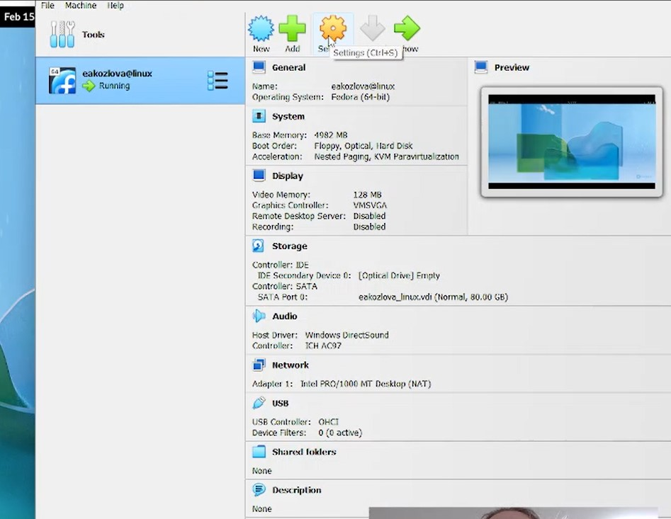{#fig:001 width=70%}

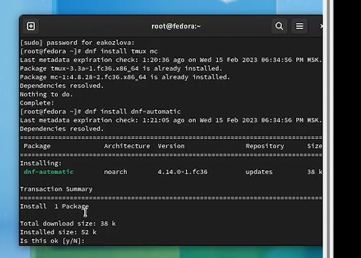{#fig:002 width=70%}

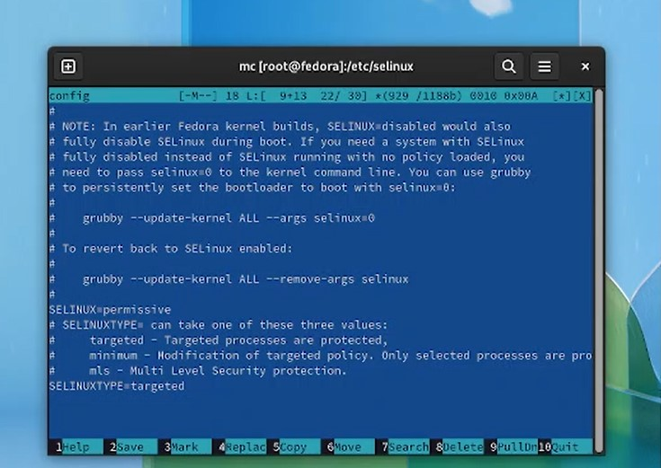{#fig:003 width=70%}

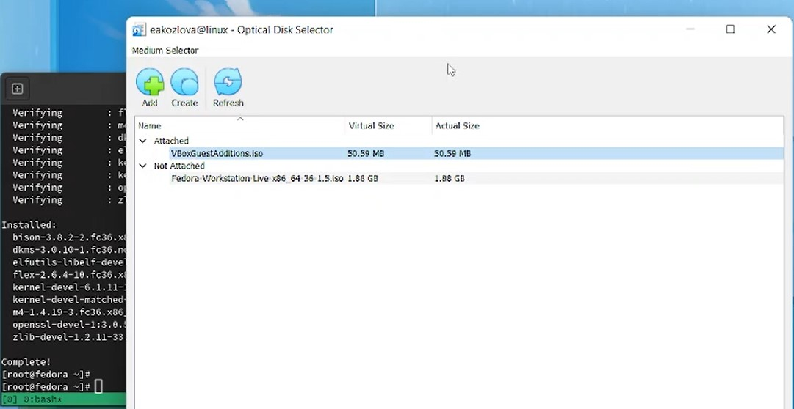{#fig:004 width=70%}

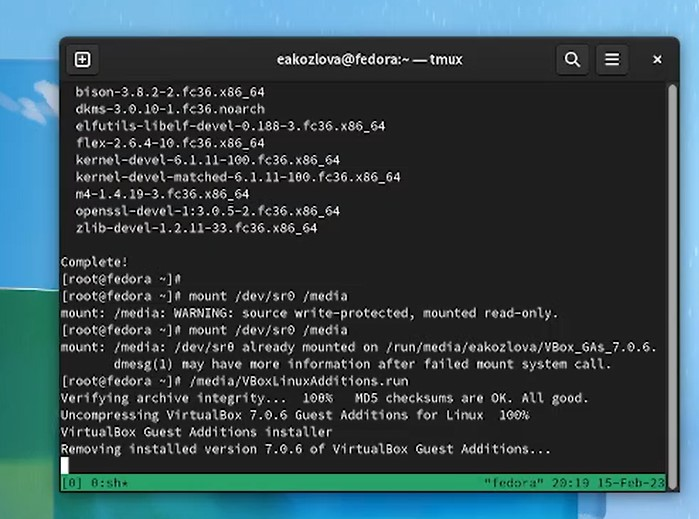{#fig:005 width=70%}

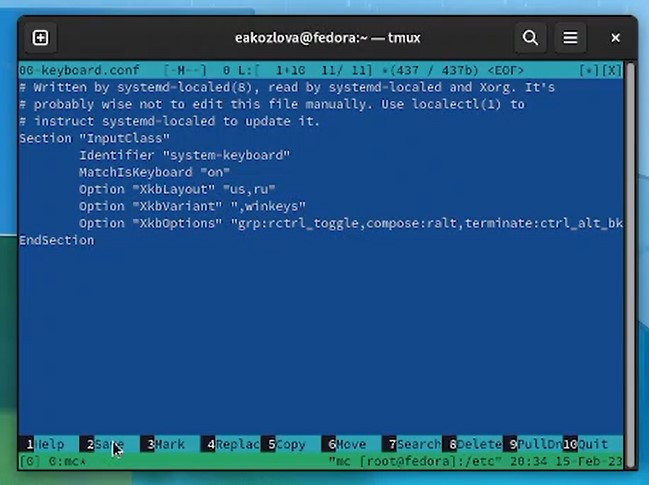{#fig:006 width=70%}

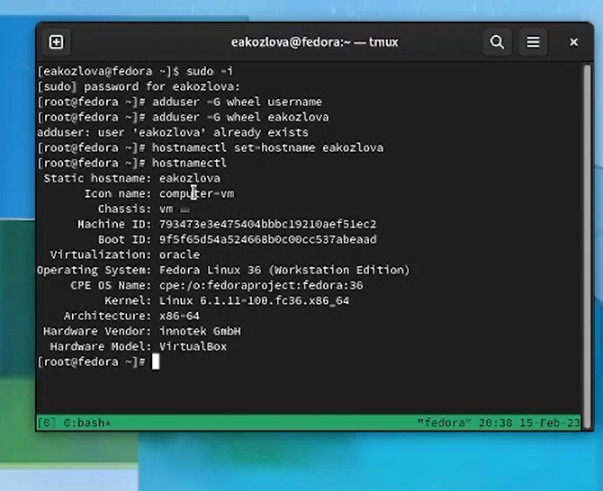{#fig:007 width=70%}

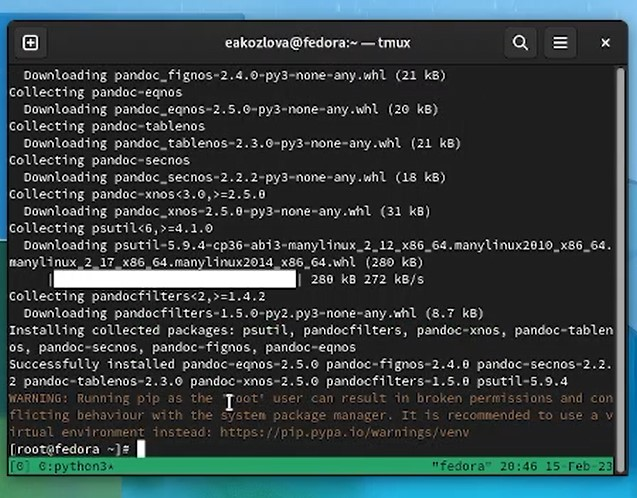{#fig:008 width=70%}

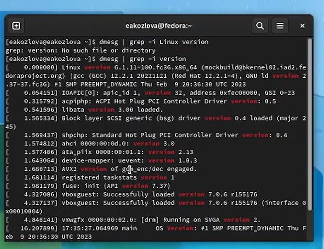{#fig:009 width=70%}

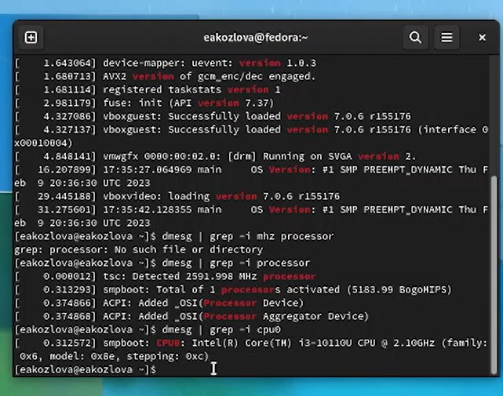{#fig:010 width=70%}

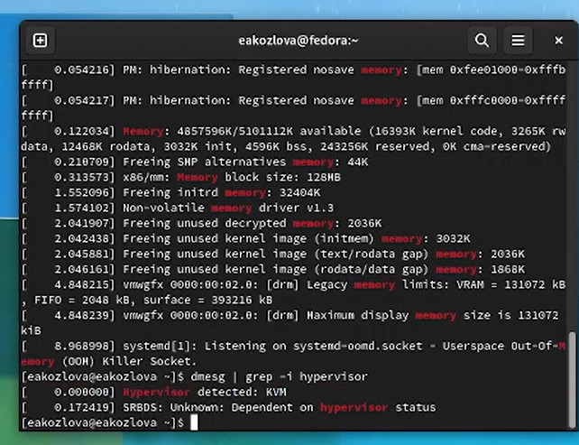{#fig:011 width=70%}

# Выводы

Я приобрела практические навыки установки и настройки виртуальной машины с базовыми сервисами.

# Список литературы{.unnumbered}

::: {#refs}
:::
